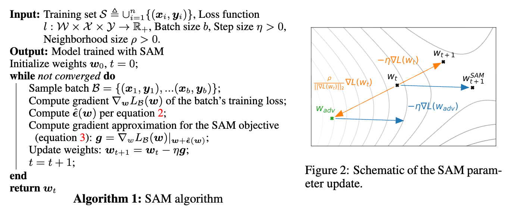
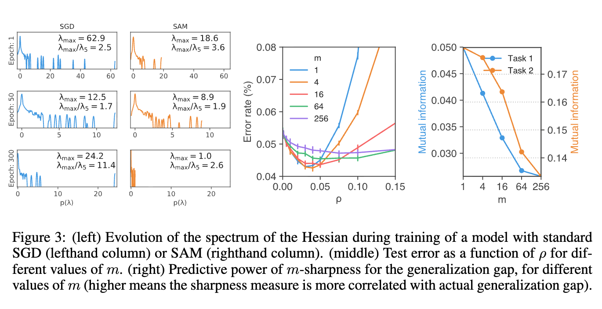
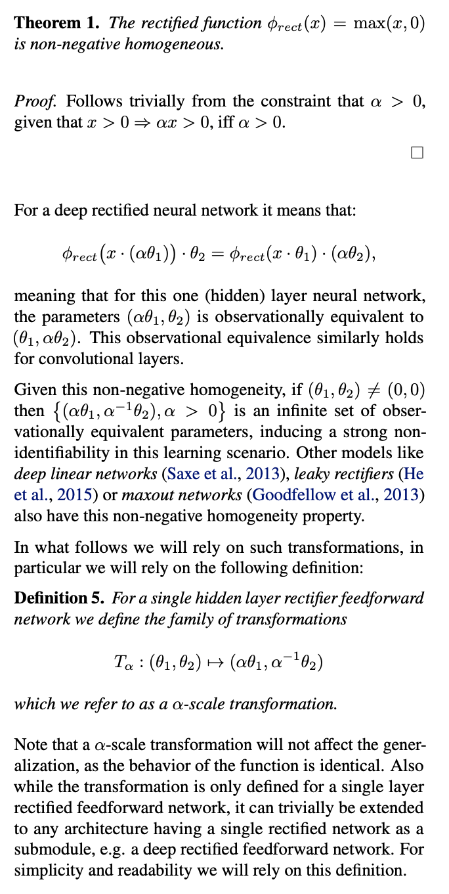

# Notes

## Sharpness-aware minimization (SAM):

Minimises loss and sharpness of the loss landscape at the same time. 

Training set: CFAR-10 and CIFAR-100 datasets with 10% noisy labels.

1st foward-backward pass: computes the perturbation direction (adversarial direction) that maximizes the loss within a certain radius $\rho$.
2nd forward-backward pass: updates the model parameters using the perturbed weights.

SAM paper outlines some details of experiments:
    1. $\rho$ (perturbation radius) = [0.01, 0.02, 0.05, 0.1, 0.2, 0.5] with 10% validation set
    2. Since SAM requires two forward-backward passes per iteration, to have a fair comparison with SGD, they train for half the number of epochs (e.g., 200 epochs for SAM vs. 400 epochs for SGD).

> Because SAM’s performance is amplified by not syncing the perturbations, data parallelism is highly recommended to leverage SAM’s full potential 

[Source code for SAM](https://github.com/davda54/sam)

Computing $\hat{\epsilon}(w)$ requires computing Hessian. To avoid computing the full Hessian matrix, which can be computationally expensive, SAM uses a finite difference approximation to compute the Hessian-vector product. This allows SAM to efficiently compute the perturbation direction without explicitly forming the Hessian matrix.

The Hessian matrix captures the curvature of the loss landscape, and its eigenvalues can provide insights into the sharpness of the minima found by the optimizer. However, computing the full Hessian matrix can be computationally expensive, especially for large models, which is why techniques like Lanczos algorithm are often used to approximate the Hessian spectrum. Source - Chaudhari et al. (2017); Keskar et al. (2017)

A good metric to track the sharpness of the loss landscape is the Hessian spectrum. The eigenvalues of the Hessian matrix can indicate how sharp or flat the minima are. A sharp minimum will have large positive eigenvalues, while a flat minimum will have smaller eigenvalues. This relationship between the Hessian spectrum and the geometry of the loss landscape is crucial for understanding generalization performance in deep learning models. 

Following are the results of the experiments conducted in the SAM paper:

## Adaptive SAM (ASAM):

SAM and some of sharpness measures suffer from sensitivity to model parameter re-scaling. 
Dinh et al. (2017) implemented reparameterization by scaling the parameters of the model by a factor of $\alpha$ and $\frac{1}{\alpha}$ in consecutive layers. This reparameterization can change the sharpness of the loss landscape without affecting the model's performance, which highlights the sensitivity of SAM to model parameterization.
This means that SAM and similar methods may not be invariant to such re-scaling, which can lead to suboptimal performance.

Details on how reparameterization was implemented by Dinh et al.:

They take a simple feedforward network with two layers (having zero bias) and apply a reparameterization by scaling the weights of the first layer by a factor of $\alpha$ and the weights of the second layer by $\frac{1}{\alpha}$. This reparameterization does not change the function represented by the network, but it can significantly affect the sharpness of the loss landscape.

ASAM addresses this issue by introducing a scale-invariant perturbation that normalizes the perturbation by the spectral norm of the weights. This allows ASAM to be invariant to re-scaling of the model parameters, which can lead to improved generalization performance.

To confirm that adaptive sharpness actually has a stronger correlation with generalization gap than sharpness, we compare rank statistics which demonstrate the change of adaptive sharpness and sharpness with respect to generalization gap.

## Questions:
1. What is CIFAR-{10, 100} dataset?
2. What are noisy labels and how do they affect model training?
3. What is classical dual norm problem and how is it related to SAM?
4. What are Hessian vector products and how are they used in SAM?
5. Including the second order Taylor expansion terms of $\nabla_s L_S(w)$ degrades the performance of SAM. Why is that the case?
6. What is confidence interval and how is it used in the context of evaluating model performance?
7. What is a Hessian spectrum and how does it relate to the sharpness of the loss landscape?
8. Need to check what the paper means when it says - 
> Intriguingly, the m-sharpness measure described above furthermore exhibits better correlation with
models’ actual generalization gaps as m decreases, as demonstrated by Figure 3 (right)7. In partic-
ular, this implies that m-sharpness with m < n yields a better predictor of generalization than the
full-training-set measure suggested by Theorem 1 in Section 2 above, suggesting an interesting new
avenue of future work for understanding generalization. 
9. Also see "mutual information between the m-sharpness measure and generalization on the two publicly available tasks from the Predicting generalization in deep learning NeurIPS2020 competition"
10. Why does batch normalization obscure the interpretation of Hessian spectrum and sharpness measures? How does it affect the optimization process in SAM and its variants?
11. Lanczos algorithm and its role in computing the Hessian spectrum for large models?
12. Relationship between loss landscape geometry and generalization performance in deep learning models? [Jiang et al., 2019]
13. What is the difference between SAM, ASAM, and M-SAM optimizers?
14. Batch normalization and its impact on model reparameterization?
15. Stochastic depth and its role in training deep neural networks?
16. What is PAC-Bayesian generalization bound and how does it relate to the analysis of SAM and its variants?
17. What is a spectral norm and how is it used in the context of ASAM to achieve scale invariance?
18. The non-Euclidean geometry of the parameter space, coupled with the manifolds of observationally equal behavior of
the model, allows one to move from one region of the parameter space to another, changing the curvature of the model
without actually changing the function. See - Desjardins et al., 2015; Salimans & Kingma,
2016
19. What is meant by rank statistics and how is it used to compare the correlation of adaptive sharpness and sharpness with generalization gap?

Read the following papers for more insights on the topics discussed above:
https://arxiv.org/pdf/2211.17192
https://arxiv.org/pdf/2410.21265
